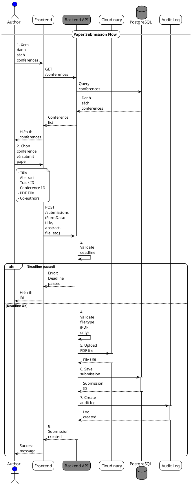
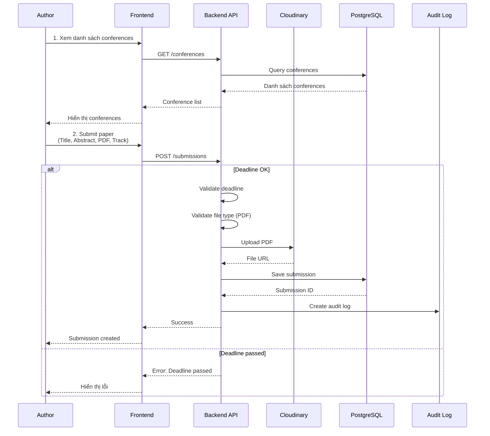
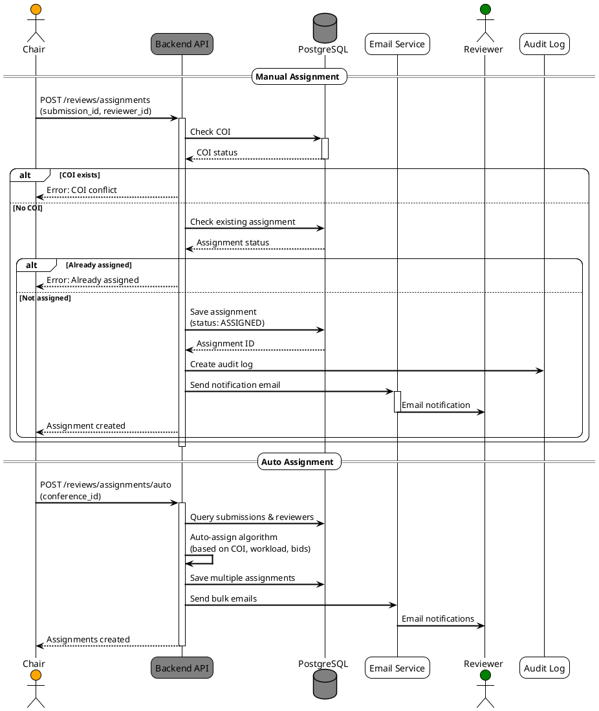
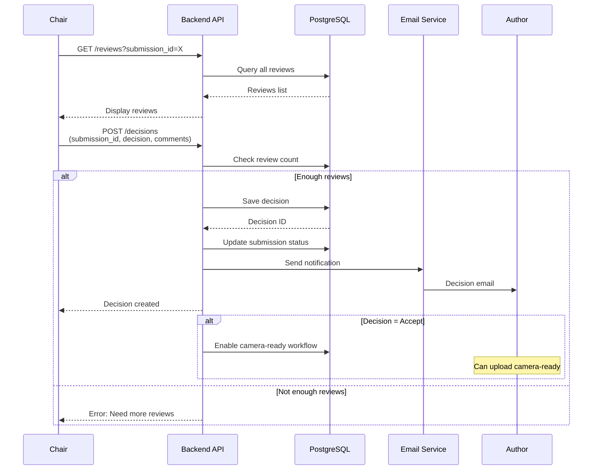

# Ví Dụ Sequence Diagram Format - Paper Submission Flow

## PlantUML Format

## Mermaid Format

## Review Assignment Flow Example (PlantUML)

## Decision Making Flow Example (Mermaid)

## Notes cho AI

Khi vẽ sequence diagram, cần lưu ý:

1. **Activation boxes**: Hiển thị khi actor đang xử lý (activate/deactivate)
2. **Alt/Opt/Loop frames**: Dùng cho các điều kiện thay thế
3. **Notes**: Thêm notes cho các điều kiện quan trọng
4. **Colors**: Phân biệt roles bằng màu sắc
5. **Error handling**: Hiển thị error flows
6. **Async operations**: Email service có thể async
7. **Database operations**: Hiển thị rõ query và response
